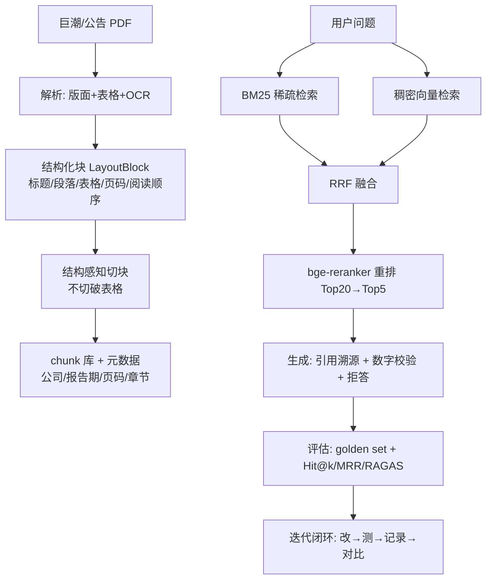

# Financial-RAG-Agent 项目规划

> 版本 v1.0 · 日期 2026-08-31 · 定位：从 0 到 1 的垂直金融 RAG
> 核心目标：**复杂解析 + 检索质量工程 + 评估闭环**，用数据证明每一层优化的价值

---

## 1. 项目定位

面向 **A 股上市公司年报 / 半年报 / 公告**（公开披露数据，版权合规）的垂直金融 RAG 系统：

```
复杂 PDF（大表格/多栏/扫描件）
        │
        ▼
结构化知识 → 混合检索(BM25+稠密+重排) → 生成(引用溯源+数字校验+拒答)
        │
        ▼
150 条 golden set + Hit@k/MRR/RAGAS 量化评估 → 迭代闭环
```

> 说明：不做"研报"（版权难拿、非法），聚焦交易所公开披露的年报/公告，数据合法可爬（巨潮资讯网）。

## 2. 五个关键决策

| # | 决策 | 结论 | 理由 |
|---|---|---|---|
| 1 | 语料范围 | 5~10 家公司 × 近 3 年年报 + 半年报 + 相关公告（30~50 份 PDF） | 覆盖多文档/多年度场景，数据准备不失控 |
| 2 | 数据源 | 巨潮资讯网(cninfo) 为主，akshare 为辅 | 公开免费；akshare 做结构化指标交叉校验 |
| 3 | 解析方案 | MinerU/PaddleOCR 做重武器，pdfplumber/camelot 做 baseline | 年报表格复杂，纯文本抽取必翻车；双轨 A/B 本身就是评估内容 |
| 4 | 检索组件 | FAISS(稠密) + bm25s(稀疏) + RRF 融合 + bge-reranker(重排) | 全部本地开源，原理可讲清，不依赖付费 API |
| 5 | 评估 | 自写 eval 框架 + RAGAS 双轨 | 自写保证可控可复现，RAGAS 提供行业标准背书 |

## 3. 总体数据流



## 4. 模块设计

### M1 数据获取（W1）✅ 已开始
- 巨潮资讯网公开接口（topSearch 取 orgId → hisAnnouncement 查公告 → static 下载 PDF）
- 限速 + 重试 + 断点续传（manifest.csv 记录状态）
- akshare 拉结构化财务指标，用于后续解析结果交叉校验
- 产物：`data/raw/*.pdf` + `data/manifest.csv`

### M2 文档解析（W2-W3）★ 核心差异化 1
三层递进：
1. **文本层（baseline）**：pdfplumber / PyMuPDF 抽文字，记录在表格/多栏/扫描件上失败的案例
2. **表格层**：pdfplumber 表格检测 + camelot（lattice/stream），输出带表头+行列结构的 Markdown/JSON
3. **版面+OCR 层（重武器）**：MinerU / PaddleOCR PP-Structure 版面分析（标题层级、阅读顺序、表格还原）+ 扫描件 OCR

统一输出 `LayoutBlock`：`{block_type, text|table, page, bbox, reading_order, 章节标题路径}`

解析质量自评：抽 10 份文档，统计**表格行列还原率 / 文字保真率 / 解析失败率**

### M3 切块策略（W3）
- 结构感知切块：按标题层级切，**绝不切破表格**
- 表格整表一块（超大表按行组切但保留表头）
- 块元数据：`doc_id / 公司 / 报告期 / 页码 / 章节路径 / block_type`
- 多策略留参数，供 A/B 实验

### M4 检索质量工程（W4）★ 核心差异化 2
- 稠密：text-embedding-v3 或 bge-m3，FAISS
- 稀疏：bm25s + jieba
- 融合：RRF + 权重实验
- 重排：bge-reranker-v2-m3（Top20→Top5）
- 金融专属增强：
  - **时间/报告期过滤**（"2023 年年报"限定范围）
  - **表格块加权**（表头含"营业收入/毛利率"的块加权）
  - **层级检索**（先章节粗筛再段落精检，解决 200 页长文档）
  - **查询改写**（LLM 规范金融术语，可选加分）

### M5 生成 + Agent（W5）
- 轻量 Agent：意图识别（事实/表格/对比/计算/拒答）→ 检索 → 生成
- 三个安全机制（金融场景核心）：
  1. **引用溯源**：回答强制带 `[1](来源文档+页码+原文)`
  2. **数字校验**：回答中数字必须能在检索片段匹配，否则修正/拒答
  3. **拒答**：分数低于阈值或超出知识库 → 明确拒绝，不编造
- 可选：财务计算工具（从报表数字算 ROE/毛利率）

### M6 评估体系（W5-W6）★ 核心差异化 3（项目一完全空白）
- **Golden set：150 条**，字段：问题/标准答案/来源文档+页码/类型标签/证据片段
- 类型分布：fact 40 / table 30 / compare 25 / calc 20 / multi_doc 20 / reject 15
- 指标：
  - 检索：Hit Rate@5 / Recall@5 / MRR / NDCG
  - 表格还原：行还原率 / 列还原率 / 单元格 F1
  - 生成：RAGAS（faithfulness / answer_relevancy / context_precision）+ 人工抽样
- **A/B 实验矩阵**（面试核心证据）：

| 实验 | 对比 | 期望结论 |
|---|---|---|
| 解析 | pdfplumber vs MinerU | 表格还原率提升 X% |
| 切块 | 固定切 vs 结构感知切 | Hit@5 提升 X% |
| 检索 | dense-only vs hybrid | 召回提升 X% |
| 重排 | 无重排 vs 有重排 | MRR 提升 X% |
| 生成 | 无校验 vs 数字校验 | 数字错误率下降 X% |

- 迭代闭环：每次改动只跑 golden set 全量回归，记录到 `experiments/`

## 5. 技术选型

| 层 | 选型 | 备注 |
|---|---|---|
| 语言/框架 | Python 3.11 + FastAPI | 复用项目一经验 |
| PDF 解析 | MinerU / PaddleOCR PP-Structure + pdfplumber/camelot | 重武器 + baseline |
| OCR | PaddleOCR / RapidOCR | 扫描件 |
| 切块 | 自写结构感知切块 | 多策略可实验 |
| Embedding | text-embedding-v3 或 bge-m3 | 中文 |
| 稀疏检索 | bm25s + jieba | 轻量 |
| 稠密索引 | FAISS | |
| 重排 | bge-reranker-v2-m3 | 本地开源 |
| Agent | LangGraph 或轻量 function-calling | 复用项目一 |
| 评估 | 自写框架 + RAGAS | 双轨 |
| 元数据 | SQLite / CSV manifest | W1 用 CSV，后续可升级 |

## 6. 目录结构

```
├── data/
│   ├── raw/          # 原始 PDF
│   ├── parsed/       # LayoutBlock 结构化 JSON
│   └── corpus/       # chunk 库
├── golden_set/       # 150 条标注数据 + 规范
├── experiments/      # 实验配置 + 结果对比
├── scripts/          # 一键跑下载/解析/检索/评估
├── src/
│   ├── ingestion/    # 下载器/解析器/OCR
│   ├── chunking/     # 切块策略
│   ├── retrieval/    # 稠密/稀疏/融合/重排
│   ├── generation/   # 回答+引用+数字校验+拒答
│   ├── agent/        # 轻量 Agent
│   └── eval/         # 指标 + 报告
├── api/              # 轻量 API demo
├── config/           # 全局配置
└── docs/             # 规划/架构/报告
```

## 7. 里程碑

| 周 | 目标 | 可交付 |
|---|---|---|
| W1 | 数据 + 语料 | 30~50 份 PDF + manifest ✅ |
| W2 | 解析 baseline | 轻量解析跑通 + 失败案例记录 |
| W3 | 重武器解析 + 切块 | LayoutBlock + 结构感知切块 + 解析质量报告 |
| W4 | 检索 | 稠密+BM25+RRF+重排全链路 + 检索实验对比表 |
| W5 | 评估 + 迭代 | 150 条 golden set + RAGAS + 完整 A/B 报告 |
| W6 | Agent + 交付 | Agent demo + 数字校验/拒答 + README + 面试素材 |

## 8. 风险与应对

| 风险 | 应对 |
|---|---|
| 巨潮反爬/限流 | 限速+重试+断点续传；失败换公开样例 PDF |
| 年报表格太复杂 | 记录失败率而非掩盖；MinerU 兜底；接受并量化 80% 还原率 |
| 150 条 golden set 工作量大 | LLM 辅助生成 + 人工校验；优先覆盖表格/对比/计算 |
| 时间不够 | 最小闭环优先：W2 就能跑通"解析→检索→问答"，优化逐步叠加 |
| 数字幻觉被面试追问 | 数字校验机制就是答案，主动讲防幻觉设计 |

## 9. Definition of Done

1. 150 条 golden set，含 6 类问题
2. 完整 A/B 实验报告：每一层优化都有量化提升数字
3. RAGAS 指标跑通，生成质量有数
4. 可演示 Agent：引用溯源 + 数字校验 + 拒答
5. README + 架构图 + 面试叙事稿

## 10. 面试叙事

> 项目一证明了"企业级 AI 助手平台和 Agent 编排能跑通"；项目二把刀插进**金融垂直领域最难的 RAG 问题**——复杂 PDF 解析、检索质量工程、评估体系——并且**用 150 条 golden set 和数据证明了每一层优化的价值**。一个是广度，一个是深度。

## 11. 变更记录

- 2026-08-31 v1.0 初版（含 W1 数据下载脚本）
